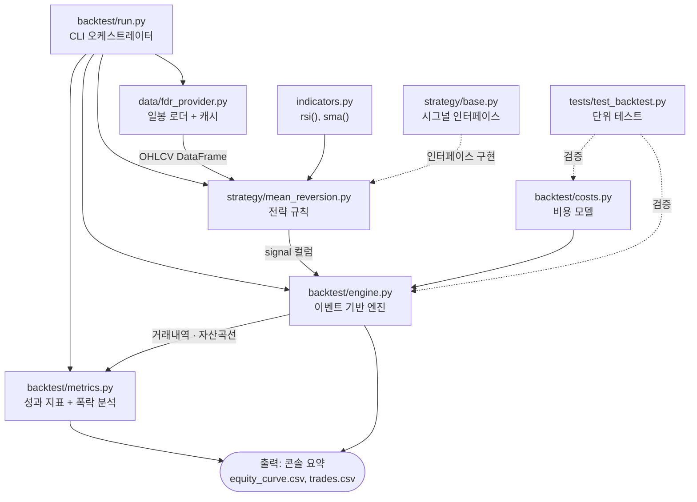

# 일봉 백테스트 모듈 설계

- **Status**: 1차 구현 완료 (2026-06-03) — 전체 56 테스트 통과, 실데이터 백테스트 검증 완료

## 1차 결과 (KODEX 200, 2014-03 ~ 2026-06, 3000봉)

baseline 규칙(RSI(2)<10 + 200일선, 5일 청산) 실데이터 결과:

| 지표 | 값 |
|------|-----|
| 총수익률 | +5.98% (≈12년) |
| CAGR | 0.49% |
| MDD | -20.74% |
| 샤프 | 0.11 |
| 거래 | 62회, 승률 56.5%, 손익비 0.86, 기대값 +9,641/거래 |
| 2020 코로나 | 1거래 **-597,615** (자본 ~6% 손실 — 꼬리 위험 실증) |

**결론: 이 baseline 은 엣지가 사실상 없음** (CAGR 0.49% = 예금만도 못함, 단순 보유 대비 크게 열위).
음의 왜도/꼬리 위험도 코로나 구간에서 실측됨. → 파라미터·규칙 개선 또는 가설 재검토 필요.

> ⚠️ 데이터 한계: FDR이 약 3000봉(2014~)만 반환 → 2008 금융위기 미포함. 전체 기간 확보 방법은 후속 과제.

---

- **작성일**: 2026-06-02
- **브랜치**: `feature/daily-backtest`

## 목표

KODEX 200(069500) 20년 일봉으로 **"공포 과매도 → 반등" 평균회귀 전략의 비용 차감 후 기대값과 폭락장 생존성**을 검증한다.
핵심 질문: *이 전략에 진짜 엣지가 있는가? 2008·2020 같은 폭락에서 죽지 않는가?*

> 배경: 원래 목표는 "1분내 폭락 감지 후 반등 매수"(인트라데이)이나, 인트라데이 장기 데이터를 무료로 확보할 수 없다.
> 따라서 **무료 장기 일봉으로 평균회귀 엣지의 존재 여부와 꼬리(폭락) 위험을 먼저 검증**하고,
> 효과가 확인되면 실시간 분봉 수집 → 인트라데이 정밀화로 넘어간다.

## 모듈 구조

```
engine/src/trading_engine/
├── data/
│   └── fdr_provider.py      # [신규] FinanceDataReader 일봉 로더 + 로컬 캐시(parquet)
├── indicators.py            # [신규] rsi(), sma() — 순수 pandas 함수
├── strategy/
│   ├── base.py              # [수정] DataFrame 기반 시그널 생성 인터페이스 추가
│   └── mean_reversion.py    # [신규] strawman 전략 구현
├── backtest/
│   ├── costs.py             # [신규] 수수료·세금·슬리피지 비용 모델
│   ├── metrics.py           # [신규] 성과 지표 계산
│   ├── engine.py            # [수정] placeholder → 실제 이벤트 기반 엔진
│   └── run.py               # [신규] CLI 진입점
└── tests/
    └── test_backtest.py     # [신규] 합성 데이터로 엔진 로직 검증
```

## 데이터 흐름

```
FDR로 069500 일봉 fetch → parquet 캐시
  → 지표 계산(RSI(2), 200일선, 5일선) DataFrame 컬럼 추가
  → 전략이 signal 컬럼 생성 (buy/sell/hold)
  → 백테스트 엔진이 일별 순회하며 포지션·손익·비용 시뮬
  → 성과 지표 + 자산곡선 + 거래내역 출력(CSV) + 폭락구간 분석
```

## 파일별 역할

| 파일 | 신규/수정 | 역할 |
|------|-----------|------|
| `data/fdr_provider.py` | 신규 | FinanceDataReader로 일봉 OHLCV를 받아오고 로컬 parquet으로 캐시. 재실행 시 네트워크 없이 빠르게 로드. `MarketDataProvider` 인터페이스 구현. |
| `indicators.py` | 신규 | 순수 기술적 지표 함수 모음. `rsi(series, period)`, `sma(series, window)`. 상태 없는 pandas Series 변환 함수라 단위 테스트·재사용 용이. |
| `strategy/base.py` | 수정 | DataFrame을 받아 `signal` 컬럼(buy/sell/hold)을 산출하는 시그널 생성 인터페이스 추가. 모든 전략의 공통 계약. |
| `strategy/mean_reversion.py` | 신규 | 검증 대상 전략 구현. `indicators`로 RSI(2)·200일선·5일선 계산 후 진입/청산 규칙을 적용해 시그널 생성. |
| `backtest/costs.py` | 신규 | 수수료·증권거래세·슬리피지 비용 모델. 매수/매도 체결 비용을 계산. ETF 거래세 면제 등 파라미터화. |
| `backtest/engine.py` | 수정 | placeholder → 이벤트 기반 백테스트 엔진. 시그널 컬럼을 일별 순회하며 next-bar 체결·포지션·손익을 시뮬레이션하고 `costs`로 비용 차감. 거래내역·자산곡선 산출. |
| `backtest/metrics.py` | 신규 | 자산곡선·거래내역 → 성과 지표(총수익률·CAGR·기대값·MDD·샤프·승률) 및 폭락 구간 분석. |
| `backtest/run.py` | 신규 | CLI 진입점. provider→strategy→engine→metrics를 연결하고 결과를 콘솔/CSV로 출력하는 오케스트레이터. |
| `tests/test_backtest.py` | 신규 | 합성 데이터로 엔진·비용 계산의 정확성을 검증하는 단위 테스트. |

## 구조도



## 핵심 설계 결정 (이유 포함)

1. **룩어헤드 편향 차단**: 시그널은 당일 종가로 계산하되, **체결은 다음 거래일 시가(next-bar open)**로.
   "당일 종가 보고 당일 종가에 산다"는 실거래 불가능한 치팅이라 배제.

2. **전략 규칙 (검증용 baseline)**:
   - 진입: `RSI(2) < 10` **그리고** `종가 > 200일 이동평균`(상승 레짐 필터)
   - 청산: `RSI(2) > 70` 회복 시, **또는** 진입 후 N거래일(기본 5) 경과 시
   - 롱 온리, 단일 종목, 포지션은 자본의 고정 비율(기본 100%)

3. **비용 모델 (현실성의 핵심)** — `costs.py`에서 파라미터화:
   - 위탁수수료: 양방향 각 ~0.015% (기본값, 조정 가능)
   - **증권거래세: KODEX 200은 ETF라 거래세 면제(0%)** — 단, 개별주 확장 시 매도 0.18% 적용되도록 플래그 분리
   - 슬리피지: 기본 5bp (시가 체결 가정)
   - → "비용 빼면 사라지는 가짜 엣지"를 잡아내는 게 목적

4. **성과 지표** (`metrics.py`):
   - 총수익률, CAGR, 거래 횟수, 승률 / 평균손익비 / 기대값, 최대낙폭(MDD), 샤프
   - ⭐ **폭락 구간 별도 분석**: 2008(금융위기)·2020(코로나)·기타 −X% 구간 거래 성과를 따로 출력 → 꼬리 위험 확인

5. **출력**: 콘솔 요약표 + `equity_curve.csv` + `trades.csv`. (차트는 의존성 추가 없이 일단 CSV로)

## 의존성 추가

`pyproject.toml`에 `finance-datareader` 추가 (pandas/numpy는 이미 있음). 무거운 시각화 라이브러리는 제외.

## 검증 방법

- 합성 데이터(알려진 시퀀스 → 예상 손익)로 **엔진 로직 단위 테스트**: 비용·체결·손익 계산 정확성.
- 실데이터 풀 백테스트 실행 → 결과 합리성 점검(거래 수, MDD, 룩어헤드 의심 신호 유무).

## 작업 순서

1. 의존성 추가 + FDR 데이터 로더(캐시 포함)
2. 지표 함수 + 전략 구현
3. 비용 모델 + 백테스트 엔진(이벤트 기반)
4. 성과 지표 + 폭락구간 분석 + CLI
5. 단위 테스트 + 실데이터 실행 + 결과 점검

## 기본 파라미터

| 항목 | 기본값 |
|------|--------|
| 대상 종목 | KODEX 200 (069500) |
| 기간 | 상장 이후 최대 (~2002~, 약 20년) |
| 진입 임계 | RSI(2) < 10, 200일선 위 |
| 청산 | RSI(2) > 70 또는 5일 경과 |
| 초기자본 | 1,000만원 |
| 수수료/슬리피지 | 0.015% / 5bp, ETF 거래세 0% |

## 미해결/추후

- 인트라데이 확장 시 실시간 분봉 수집기 별도 계획 필요.
- 개별 종목으로 확장 시 생존편향(상폐 종목 포함) 처리 필요.
- 수정주가(배당/분할) 반영 여부 데이터 소스에서 확인 필요.
